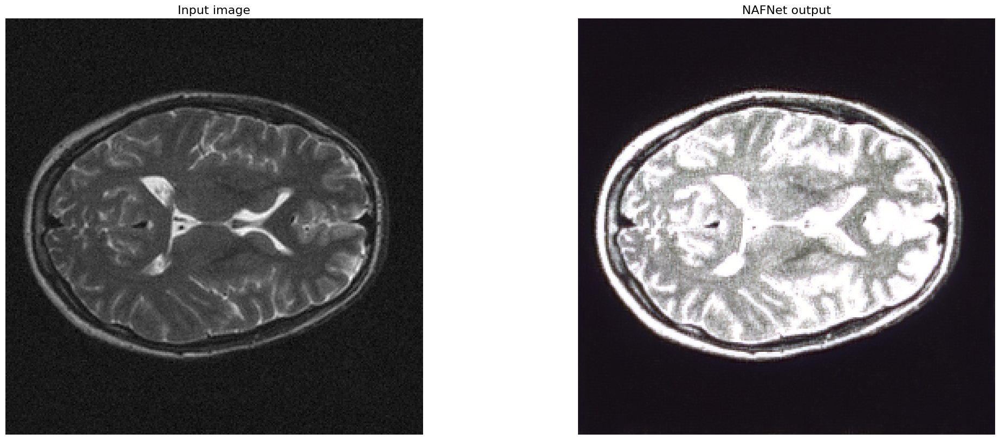
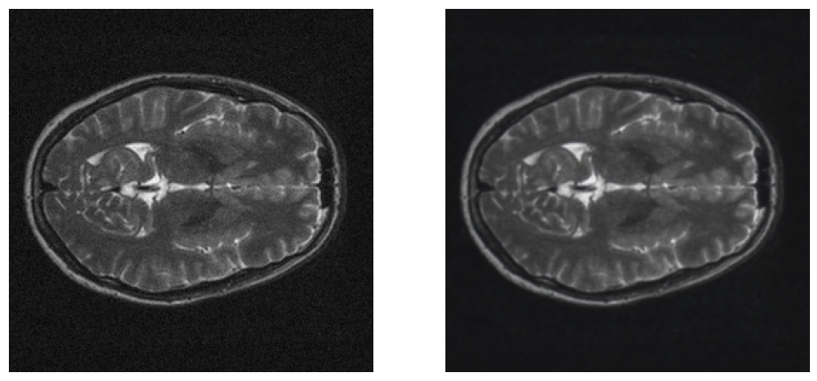

# Modern Denoising

In this repo we investigate modern denoising methods. 
Our focus is on `Noise2Clean` models as `NAFNet` and `Restormer` 
Find more detailed analysis in notebook! 

## Adding Noise
additive Gaussian noise with an average of zero and a deviation from a standard equal to 0.02 of the maximum brightness available in a set of 130 images

## Denoising

### NAFNet

    

Our *NAFNet* output shows that the network has very aggressively “flattened” the noise, but in doing so it also blown out much of the underlying anatomy and contrast.

### Restormer

    

The *Restormer* output shows a very clean, anatomically plausible brain slice, with almost all of the grainy speckle we completely removed.